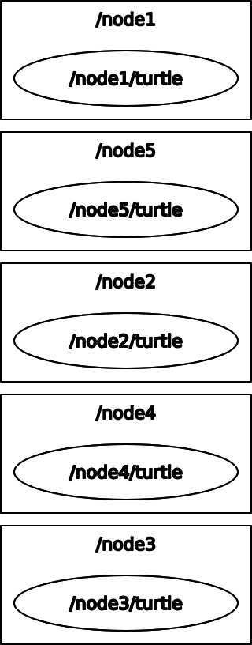
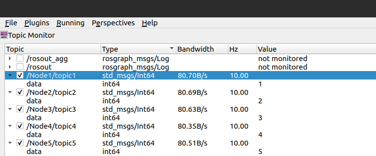

# ROS Pylauncher

[](https://www.repostatus.org/#active)


## Overview

Lauch Files are a great way to launch multiple ROS nodes. In this project, different ways of launching multiple instances of a node in ROS is shown. Different methods of launching the nodes such as using `xml` files and `python script` are demonstrated in this project.  






---


## Concepts Used

Following are the concepts used for this project:

- **Manually launching multiple instances of same node using launch files**
  - To run multiple instances of same node 
- **Dynamically launching multiple instances of same node using launch files**
  - To recursively start same node with different node names
- **Dynamically launching multiple instances of same node using Python scripts and ROSlaunch API**
  - To launch nodes in sequence with custom node name, topic name, and broadcasting tf data 


---


## Directory Structure

- Following is the directory structure of the package
  ```txt
  .
  ├── CMakeLists.txt
  ├── docs                                         Supporting files for README
  │   ├── manual.png
  │   ├── ROSAPI.png
  │   ├── rosgraph.png
  │   ├── ros.png
  │   └── topics_info.png
  ├── include
  │   └── pylauncher
  ├── launch                                       Launch Files
  │   ├── dynamic.launch                               Dynamically launch multiple instances of a node 
  │   └── manual.launch                                Manually launch multiple instances of a node
  ├── nodes                                        ROS Nodes
  │   ├── blueprint_node_launch.py                     Template Node to be launched using xml launch files
  │   └── ROSAPI
  │       ├── blueprint_node.py                        Template Node to be lanched using python launch script
  │       ├── pylaunch.py                              Script to launch ROS Nodes
  │       └── turtle.py                                Script containing class for turtles in turtlesim 
  ├── package.xml
  ├── README.md
  └── src
  ```
  


---


## Coding Style Guide - PEP8


---


## Setup and Run

To run the project on your local system, follow the procedure:

- Download the packages - `pylauncher`

- Copy these packages to your ROS workspace i.e. `~/ROS_ws/src/`

- Build the work-space
  - `$ cd ~/ROS_ws/` 
  - `$ catkin_make`
- Open new terminal and source the ROS workspace - `source ~/ROS_ws/devel/setup.bash`


### Using XML

- Files associated - `manual.launch`,  `dynamic.launch` and `blueprint_node_launch.py`

- To run the manual launch file, run the following command

  `$ roslaunch pylauncher manual.launch`

- To run the dynamic launch file, run the following command

  `$ roslaunh pylauncher dynamic.launch num:=5`


### Using Python Script

- File associated - `pylauncher.py` and `blueprint_node.py`

- Navigate to ROSAPI directory using following command

  `$ cd ~/ROS_ws/src/pylauncher/nodes/ROSAPI/`

- Run the python script to launch nodes using python script

  `$ python3 pylaunch.py 5`


---


## Article

[](https://medium.com/p/9ac50951e230/edit)


---


## Contact

[](https://www.linkedin.com/in/shilpaj-bhalerao/)[](https://github.com/Shilpaj1994) [](https://www.youtube.com/channel/UCucf49_Iau18mG5YFFCSpmw?view_as=subscriber)